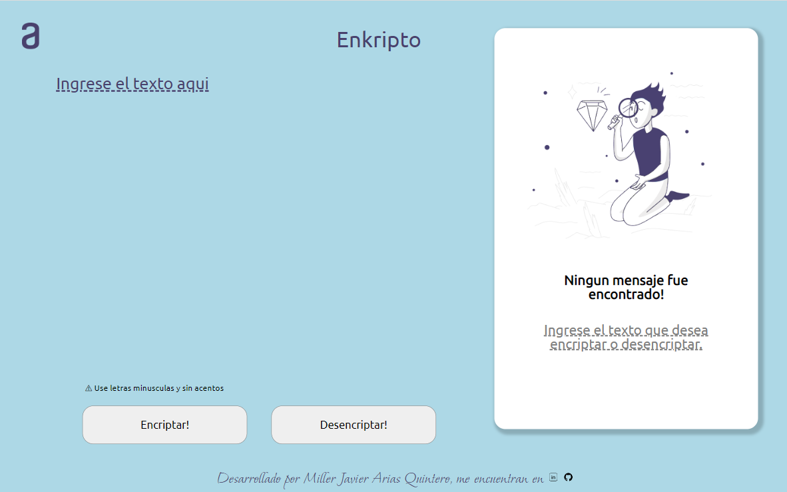
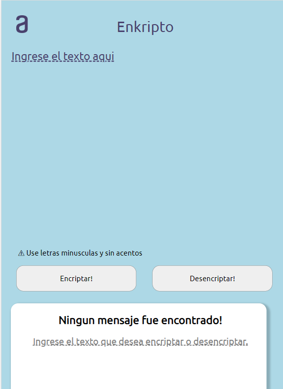
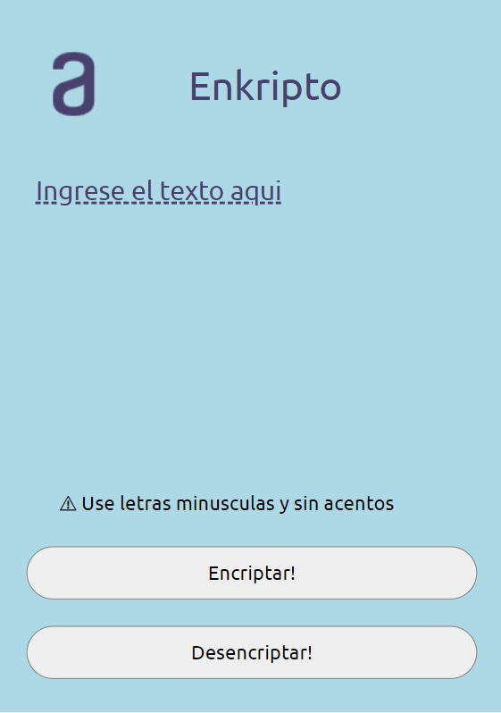

<h1 align="center" id="title"> Enkripto </h1>

Primer challenge hecho en Alura Oracle Next Education, encriptador/desencriptador de texto según ciertas directrices mostradas mas adelante en este repositorio #challengeonecodificador4

## Tabla de Contenidos
- [Enkripto](#title)
  - [Tabla de Contenidos](#tabla-de-contenidos)
  - [Llaves de encriptación](#llaves-de-encriptación)
  - [Requisitos](#requisitos)
  - [Demostraciones](#demostraciones)
  - [Tecnologias usadas](#tecnologias-usadas)
  - [Recursos Utiles](#recursos-utiles)
  - [Licencia](#licencia)
  - [Autor](#autor)

  ***

### Llaves de encriptación

- La letra "e" es convertida para "enter"
- La letra "i" es convertida para "imes"
- La letra "a" es convertida para "ai"
- La letra "o" es convertida para "ober"
- La letra "u" es convertida para "ufat"

***

### Requisitos

- Debe funcionar solo con letras minúsculas

- No deben ser utilizados letras con acentos ni caracteres especiales

- Debe ser posible convertir una palabra para la versión encriptada también devolver una palabra encriptada para su versión original.

***
### Demostraciones
La pagina se puede ver en el link a continuacion
## [Enkripto](https://encripto.vercel.app/) 
Las diferentes pantallas de la pagina son:
### Escritorio

### Tablet

### Celular

***
Tambien puedes ver el funcionamiento [aqui](https://youtu.be/KNxUHY5TKPA)
### Tecnologias usadas
Proyecto desarrollado completamente en
- HTML
- CSS
- JS
### Recursos Utiles
Durante el proceso se ha utilizado la documentacion oficial de javascript
- [Mozilla for Developers](https://developer.mozilla.org/en-US/docs/Web/HTML)
### Licencia
> This project is licensed under MIT.
### Autor
Hecho por [Miller1999](https://github.com/Miller1999)

